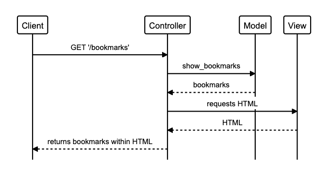

# Bookmark Manager

## Dependencies

ruby version
- `2.7.2`

gems
- `capybara`
- `coveralls`
- `puma`
- `rack`
- `rspec`
- `rspec-sinatra`
- `rubocop`
- `sinatra`

## Getting started

## Setting up database

- First, connect to psql

### Development Environment:

  - Create `bookmark_manager` database:
  ```sql
  CREATE DATABASE bookmark_manager;
  ```
  - Create `bookmarks` table
  ```sql
  CREATE TABLE bookmarks(
    id SERIAL PRIMARY KEY,
    url VARCHAR ( 60 )
  );

### Test Environment

  - Create `bookmark_manager_test` database:
  ```sql
  CREATE DATABASE bookmark_manager;
  ```
  - Create identical `bookmarks` table as above

## Running tests

## Specifications

- Show a list of bookmarks
- Add new bookmarks
- Delete bookmarks
- Update bookmarks
- Comment on bookmarks
- Tag bookmarks into categories
- Filter bookmarks by tag
- Users are restricted to manage only their own bookmarks

## User stories

### Show a list of bookmarks

```
As a user,
So that I can quickly visit my favourite sites,
I want to be able to see a list of bookmarks
```



### Add new bookmarks

```
As a website user,
So that I can revisit pages I enjoy,
I want to be able to add bookmarks
```

### Delete bookmarks

```
As a website user,
So that I can remove bookmarks I no longer need,
I want to be able to delete bookmarks
```

### Update bookmarks

### Comment on bookmarks

### Tag bookmarks into categories

### Filter bookmarks by tag

### Users are restricted to manage only their own bookmarks
